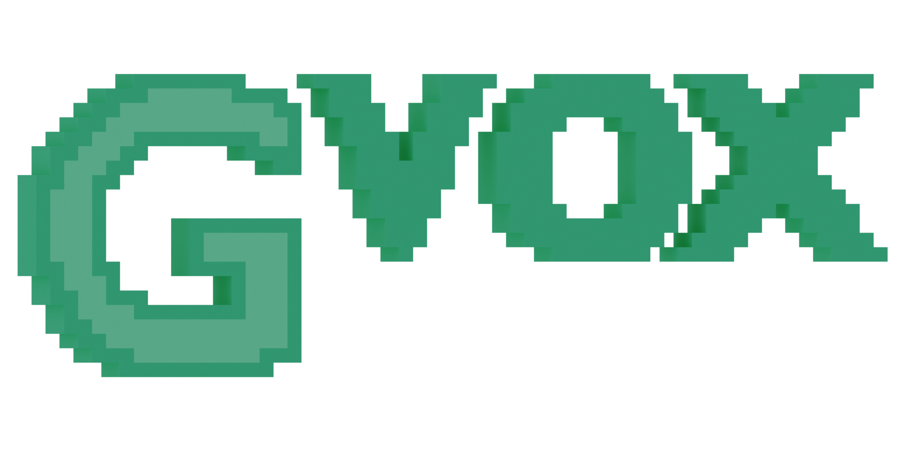

# GVOX Engine

<p align="center">
  <!-- <a href="https://github.com/GabeRundlett/gvox_engine"> -->
    
  <!-- </a> -->
</p>

## A highly moddable 3D voxel engine
GVOX Engine is a moddable cross-platform voxel engine designed to give
freedom to creators, be they artists or game developers.

Currently, it's nowhere near any usability, but there are demos available
on [this repo's releases page](https://github.com/GabeRundlett/gvox_engine/releases), as well as on [Gabe's Discord server](https://discord.com/invite/FPVNeej5sr).

## Building
To build GVOX Engine, you just need Git, CMake, and [the Vulkan SDK](https://vulkan.lunarg.com/sdk/home#windows).

For now, you must have the following things installed to build the repository
 * A C++ compiler
 * CMake (3.21 or higher)
 * Git
 * (optionally, as it'll be automatically downloaded if not installed) vcpkg (plus the VCPKG_ROOT environment variable)

Once you have these things installed, you should be able to build just by running these commands in the root directory of the repository

### Windows

```
cmake --preset=cl-x86_64-windows-msvc
cmake --build --preset=cl-x86_64-windows-msvc-debug
```

### Linux

```
cmake --preset=gcc-x86_64-linux-gnu
cmake --build --preset=gcc-x86_64-linux-gnu-debug
```

The first command, on either platform, will configure the CMake project, and the second will build it in debug mode. If you'd like to build in release mode, you can change `debug` to `release`. The executable will be output into the `./.out/<preset-name>/Debug/` folder, along side all the necessary shared libraries. 
