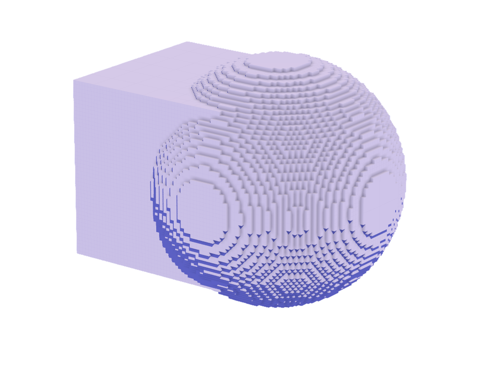
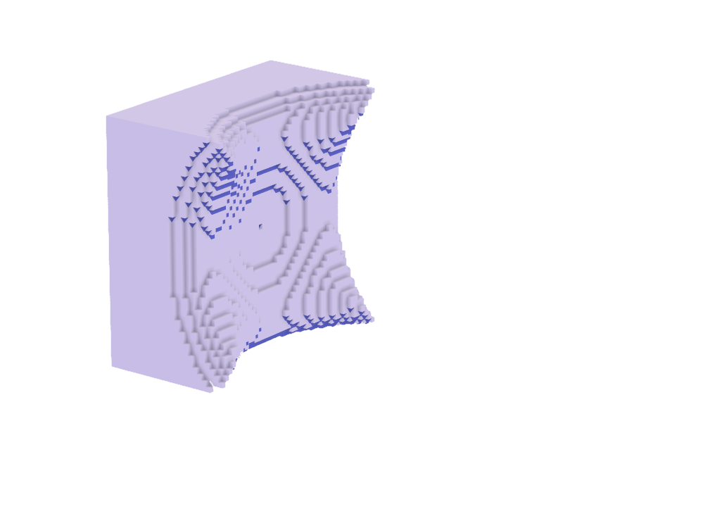
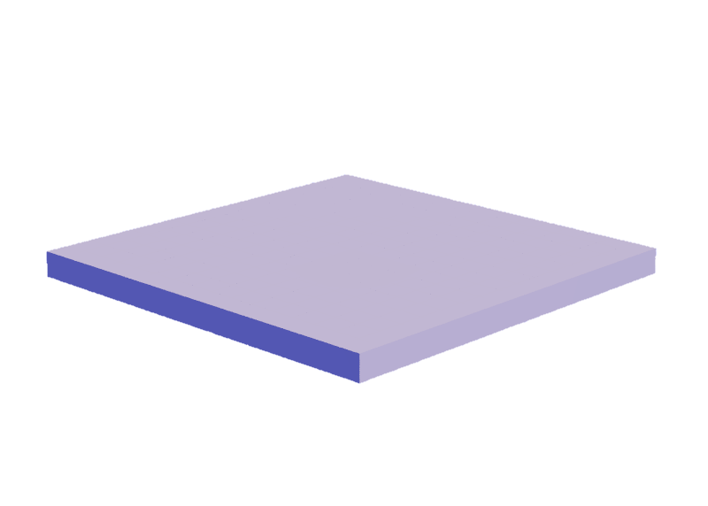
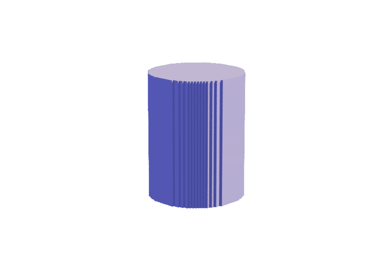
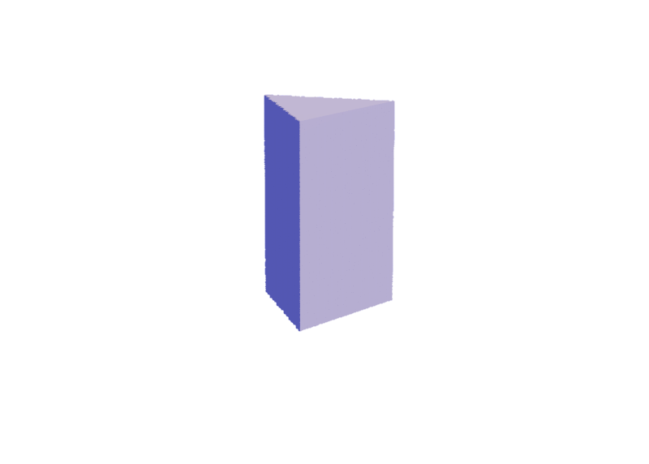
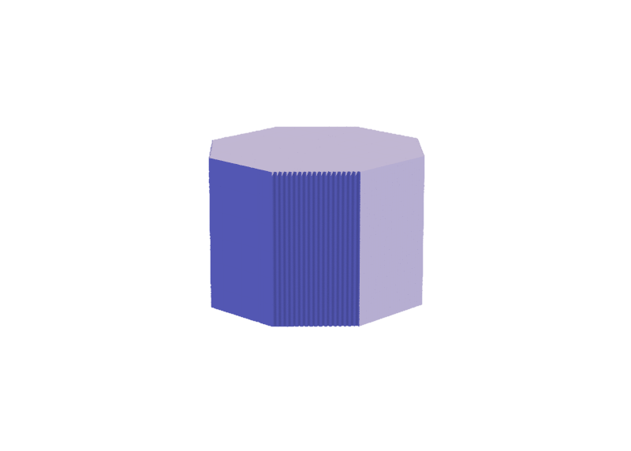
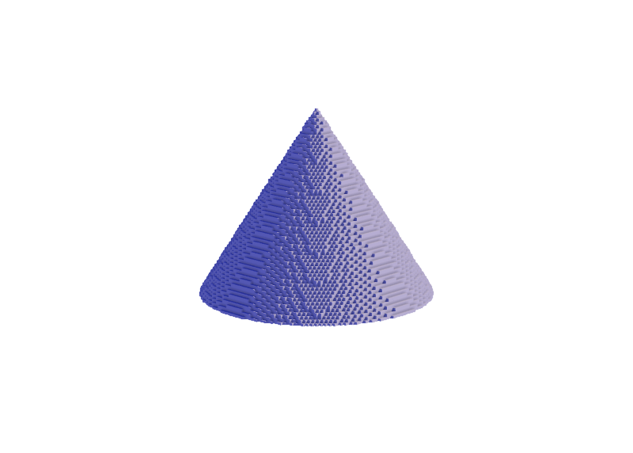
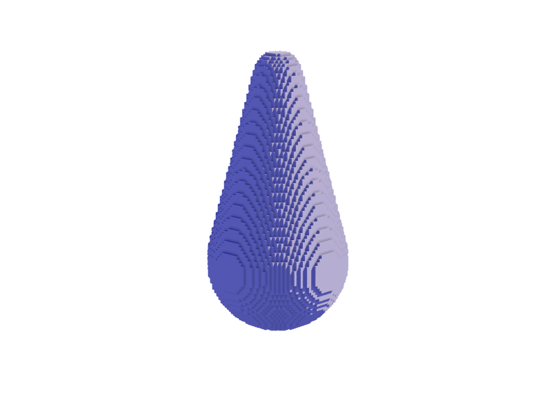
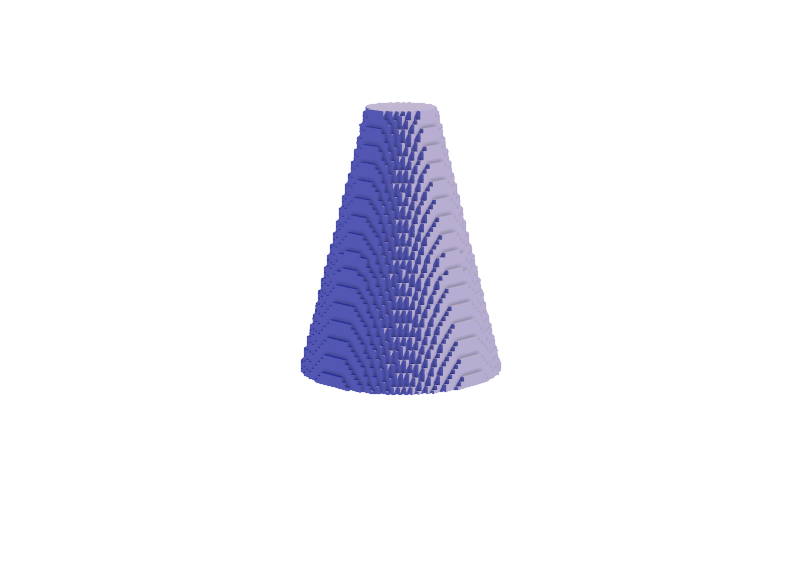

# Brushes

Brushes define how voxels should generate

## THIS PAGE IS A WORK IN PROGRESS


## Chapters

 - [Combination Operators](#combination-operators)
    - [Union](#union)
    - [Intersection](#intersection)
    - [Difference](#difference)
    - [Smooth Union](#smooth-union)
    - [Smooth Intersection](#smooth-intersection)
    - [Smooth Difference](#smooth-difference)
 - [Combination Operators](#combination-operators)
    - [Plane](#plane)
    - [Sphere](#sphere)
    - [Ellipsoid](#ellipsoid)
    - [Box](#box)
    - [Box Frame](#box-frame)
    - [Cylinder](#cylinder)
    - [Triangular Prism](#triangular-prism)
    - [Hexagonal Prism](#hexagonal-prism)
    - [Octagonal Prism](#octagonal-prism)
    - [Capsule](#capsule)
    - [Cone](#cone)
    - [Round Cone](#round-cone)
    - [Capped Cone](#capped-cone)
    - [Torus](#torus)
    - [Octahedron](#octahedron)
    - [Pyramid](#pyramid)

<!-- ## Walkthrough

### Making a Pumpkin -->

## Combination Operators

### Union


usage:

`f32 sd_union(in f32 a, in f32 b);`
```glsl
BoundingBox box;
box.bound_min = f32vec3(1);
box.bound_max = f32vec3(1 + 3 * 2);
value = sd_box(brush.p, box);

f32 r = 4;
f32vec3 center = f32vec3(3 + 1) + f32vec3(3, 0, 0);
value = sd_union(value, sd_sphere(brush.p - center, r));
```

### Intersection


usage:

`f32 sd_intersection(in f32 a, in f32 b);`
```glsl
BoundingBox box;
box.bound_min = f32vec3(1);
box.bound_max = f32vec3(1 + 3 * 2);
value = sd_box(brush.p, box);

f32 r = 4;
f32vec3 center = f32vec3(3 + 1) + f32vec3(3, 0, 0);
value = sd_intersection(value, sd_sphere(brush.p - center, r));
```

### Difference


usage:
```glsl
BoundingBox box;
box.bound_min = f32vec3(1);
box.bound_max = f32vec3(1 + 3 * 2);
value = sd_box(brush.p, box);

f32 r = 4;
f32vec3 center = f32vec3(3 + 1) + f32vec3(3, 0, 0);
value = sd_difference(value, sd_sphere(brush.p - center, r));
```

`f32 sd_difference(in f32 a, in f32 b);`

### Smooth Union


usage:

`f32 sd_smooth_union(in f32 a, in f32 b, in f32 k);`
```glsl
BoundingBox box;
box.bound_min = f32vec3(1);
box.bound_max = f32vec3(1 + 3 * 2);
value = sd_box(brush.p, box);

f32 r = 4;
f32vec3 center = f32vec3(3 + 1) + f32vec3(3, 0, 0);
value = sd_smooth_union(value, sd_sphere(brush.p - center, r), 2.0);
```

### Smooth Intersection


usage:

`f32 sd_smooth_intersection(in f32 a, in f32 b, in f32 k);`
```glsl
BoundingBox box;
box.bound_min = f32vec3(1);
box.bound_max = f32vec3(1 + 3 * 2);
value = sd_box(brush.p, box);

f32 r = 4;
f32vec3 center = f32vec3(3 + 1) + f32vec3(3, 0, 0);
value = sd_smooth_intersection(value, sd_sphere(brush.p - center, r), 2.0);
```

### Smooth Difference


usage:

`f32 sd_smooth_difference(in f32 a, in f32 b, in f32 k);`
```glsl
BoundingBox box;
box.bound_min = f32vec3(1);
box.bound_max = f32vec3(1 + 3 * 2);
value = sd_box(brush.p, box);

f32 r = 4;
f32vec3 center = f32vec3(3 + 1) + f32vec3(3, 0, 0);
value = sd_smooth_difference(value, sd_sphere(brush.p - center, r), 2.0);
```

## Shape Operators

---

### Plane


usage:

`f32 sd_plane(in f32vec3 p);`
```glsl
f32vec3 center = f32vec3(0, 0, 1);
value = sd_plane(brush.p - center);
```

### Sphere


usage:

`f32 sd_sphere(in f32vec3 p, in f32 r);`
```glsl
f32 r = 4;
f32vec3 center = f32vec3(r + 1);
value = sd_sphere(brush.p - center, r);
```

### Ellipsoid


usage:

`f32 sd_ellipsoid(in f32vec3 p, in f32vec3 r);`
```glsl
f32vec3 r = f32vec3(2, 3, 4);
f32vec3 center = f32vec3(r + 1);
value = sd_ellipsoid(brush.p - center, r);
```

### Box


usage:

`f32 sd_box(in f32vec3 p, in f32vec3 size);`
```glsl
f32vec3 r = f32vec3(4);
f32vec3 center = r + 1;
value = sd_box(brush.p - center, r);
```

`f32 sd_box(in f32vec3 p, in BoundingBox box);`
```glsl
BoundingBox box;
box.bound_min = f32vec3(1);
box.bound_max = f32vec3(1 + 4 * 2);
value = sd_box(brush.p, box);
```

### Box Frame


usage:

`f32 sd_box_frame(in f32vec3 p, in f32vec3 b, in f32 e);`
```glsl
f32vec3 r = f32vec3(4);
f32vec3 center = r + 1;
value = sd_box_frame(brush.p - center, r, 1);
```

or

`f32 sd_box_frame(in f32vec3 p, in BoundingBox box, in f32 e);`
```glsl
BoundingBox box;
box.bound_min = f32vec3(1);
box.bound_max = f32vec3(1 + 4 * 2);
value = sd_box_frame(brush.p, box, 1);
```

### Cylinder


usage:

`f32 sd_cylinder(in f32vec3 p, in f32 r, in f32 h);`
```glsl
f32 r = 4;
f32 h = 3;
f32vec3 center = f32vec3(r + 1, r + 1, h + 1);
value = sd_cylinder(brush.p - center, r, h);
```

or, in an arbitrary orientation:


`f32 sd_cylinder(f32vec3 p, f32vec3 a, f32vec3 b, f32 r)`
```glsl
f32 r = 2;
f32vec3 p0 = f32vec3(r + 1) + f32vec3(0, 2, 0);
f32vec3 p1 = p0 + f32vec3(1, -2, 8);
value = sd_cylinder(brush.p, p0, p1, r);
```

### Triangular Prism


usage:

`f32 sd_triangular_prism(in f32vec3 p, in f32 r, in f32 h);`
```glsl
f32 r = 4;
f32 h = 3;
f32vec3 center = f32vec3(r + 1, r + 1, h + 1);
value = sd_triangular_prism(brush.p - center, r, h);
```

### Hexagonal Prism


usage:

`f32 sd_hexagonal_prism(in f32vec3 p, in f32 r, in f32 h);`
```glsl
f32 r = 4;
f32 h = 3;
f32vec3 center = f32vec3(r + 1, r + 1, h + 1);
value = sd_hexagonal_prism(brush.p - center, r, h);
```

### Octagonal Prism


usage:

`f32 sd_octagonal_prism(in f32vec3 p, in f32 r, in f32 h);`
```glsl
f32 r = 4;
f32 h = 3;
f32vec3 center = f32vec3(r + 1, r + 1, h + 1);
value = sd_octagonal_prism(brush.p - center, r, h);
```

### Capsule


usage:

`f32 sd_capsule(in f32vec3 p, in f32vec3 a, in f32vec3 b, in f32 r);`
```glsl
f32 r = 2;
f32vec3 p0 = f32vec3(r + 1) + f32vec3(0, 2, 0);
f32vec3 p1 = p0 + f32vec3(1, -2, 8);
value = sd_capsule(brush.p, p0, p1, r);
```

### Cone


usage:

`f32 sd_cone(in f32vec3 p, in f32 c, in f32 h);`
```glsl
f32 slope = 5.0 / 8.0;
f32 h = 8;
f32vec3 center = f32vec3(h + 1);
value = sd_cone(brush.p - center, slope, h);
```

### Round Cone


usage:

`f32 sd_round_cone(in f32vec3 p, in f32 r1, in f32 r2, in f32 h);`
```glsl
f32 r0 = 3;
f32 r1 = 1;
f32 h = 8;
f32vec3 p = f32vec3(r0 + 1);
value = sd_round_cone(brush.p - p, r0, r1, h);
```

or, in an arbitrary orientation:


`f32 sd_round_cone(in f32vec3 p, in f32vec3 a, in f32vec3 b, in f32 r1, in f32 r2);`
```glsl
f32 r0 = 3;
f32 r1 = 1;
f32vec3 p0 = f32vec3(r0 + 1) + f32vec3(0, 2, 0);
f32vec3 p1 = p0 + f32vec3(1, -2, 8);
value = sd_round_cone(brush.p, p0, p1, r0, r1);
```

### Capped Cone


usage:

`f32 sd_capped_cone(in f32vec3 p, in f32 r1, in f32 r2, in f32 h);`
```glsl
f32 r0 = 3;
f32 r1 = 1;
f32 h = 4;
f32vec3 center = f32vec3(0, 0, h) + r0 + 1;
value = sd_capped_cone(brush.p - center, r0, r1, h);
```

or, in an arbitrary orientation:


`f32 sd_capped_cone(in f32vec3 p, in f32vec3 a, in f32vec3 b, in f32 ra, in f32 rb);`
```glsl
f32 r0 = 3;
f32 r1 = 1;
f32vec3 p0 = f32vec3(r0 + 1) + f32vec3(0, 2, 0);
f32vec3 p1 = p0 + f32vec3(1, -2, 8);
value = sd_capped_cone(brush.p, p0, p1, r0, r1);
```

### Torus


usage:

`f32 sd_torus(in f32vec3 p, in f32vec2 t);`
```glsl
f32vec2 r = f32vec2(4, 2);
value = sd_torus(brush.p - (f32vec3(r.x + r.y, r.x + r.y, r.y) + 1), r);
```

### Octahedron


usage:

`f32 sd_octahedron(in f32vec3 p, in f32 s);`
```glsl
f32 r = 4;
f32vec3 center = f32vec3(r + 1);
value = sd_octahedron(brush.p - center, r);
```

### Pyramid


usage:

`f32 sd_pyramid(in f32vec3 p, in f32 r, in f32 h);`
```glsl
f32 r = 8;
f32 h = 10;
f32vec3 center = f32vec3(r + 1, r + 1, 1);
value = sd_pyramid(brush.p - center, r, h);
```
