## THIS PAGE IS A WORK IN PROGRESS


## Chapters

 - [Brushes](#brushes)
    - [Combination Operators](#combination-operators)
        - [Union](#union)
        - [Intersection](#intersection)
        - [Difference](#difference)
        - [Smooth Union](#smooth-union)
        - [Smooth Intersection](#smooth-intersection)
        - [Smooth Difference](#smooth-difference)
    - [Combination Operators](#combination-operators)
        - [Plane](#plane)
        - [Sphere](#sphere)
        - [Ellipsoid](#ellipsoid)
        - [Box](#box)
        - [Box Frame](#box-frame)
        - [Cylinder](#cylinder)
        - [Triangular Prism](#triangular-prism)
        - [Hexagonal Prism](#hexagonal-prism)
        - [Octagonal Prism](#octagonal-prism)
        - [Capsule](#capsule)
        - [Cone](#cone)
        - [Round Cone](#round-cone)
        - [Capped Cone](#capped-cone)
        - [Torus](#torus)
        - [Octahedron](#octahedron)
        - [Pyramid](#pyramid)

# Brushes

Brushes define how voxels should generate

## Variables and Types

### BrushInput
The `BrushInput` type has the following declaration
```cpp
struct BrushInput {
    daxa_f32vec3 p;
    daxa_f32vec3 origin;
    daxa_f32vec3 begin_p;
    Voxel prev_voxel;
};
```
 - `p` represents the worldspace position of the current voxel RELATIVE to the brush origin
 - `origin` is the current brush origin, so if you add `brush.p` to `brush.origin`, then it will be the absolute worldspace voxel position
 - `begin_p` is the position of the origin at the time of starting the edit, so when you start holding down the moust button, this is set, but doesn't get set until you let go again.
 - `prev_voxel` is the voxel data previously at the position `p`
 
 ### INPUT
 The `INPUT` variable has the following "public" members
  - `frame_dim` is a `daxa_u32vec2` that is the size of the rendered viewport
  - `time` is a `daxa_f32` holding the current time in seconds

<!-- ## Walkthrough

### Making a Pumpkin -->

## Combination Operators

### Union


usage:

`daxa_f32 sd_union(in daxa_f32 a, in daxa_f32 b);`
```glsl
BoundingBox box;
box.bound_min = daxa_f32vec3(1);
box.bound_max = daxa_f32vec3(1 + 3 * 2);
value = sd_box(brush.p, box);

daxa_f32 r = 4;
daxa_f32vec3 center = daxa_f32vec3(3 + 1) + daxa_f32vec3(3, 0, 0);
value = sd_union(value, sd_sphere(brush.p - center, r));
```

### Intersection
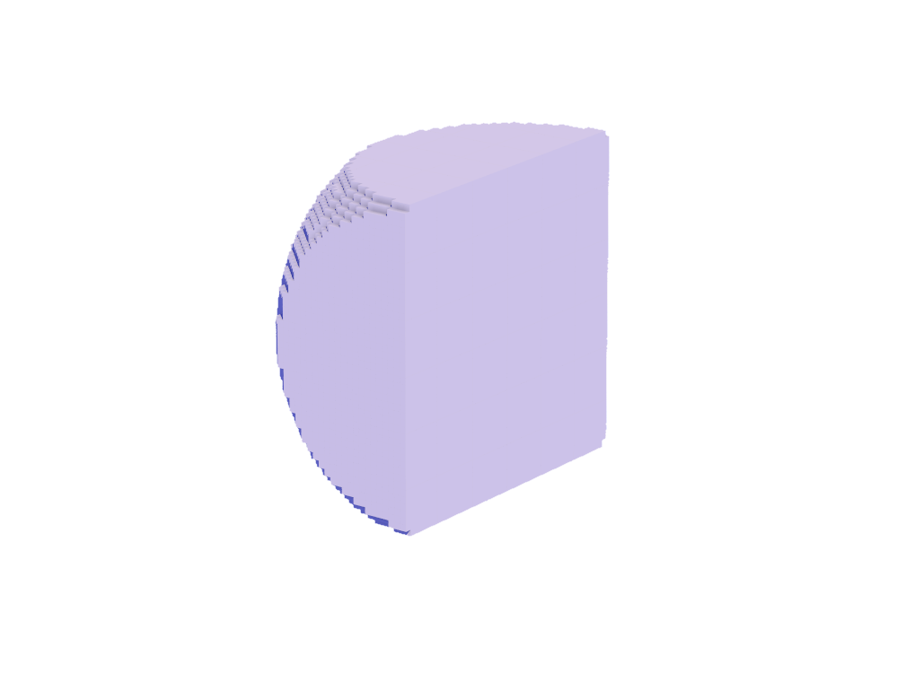

usage:

`daxa_f32 sd_intersection(in daxa_f32 a, in daxa_f32 b);`
```glsl
BoundingBox box;
box.bound_min = daxa_f32vec3(1);
box.bound_max = daxa_f32vec3(1 + 3 * 2);
value = sd_box(brush.p, box);

daxa_f32 r = 4;
daxa_f32vec3 center = daxa_f32vec3(3 + 1) + daxa_f32vec3(3, 0, 0);
value = sd_intersection(value, sd_sphere(brush.p - center, r));
```

### Difference
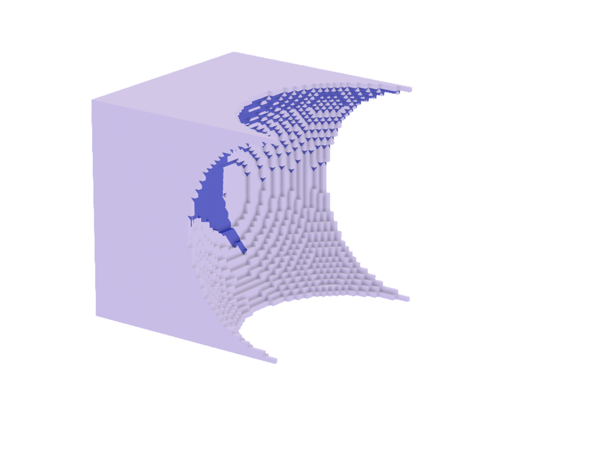

usage:
```glsl
BoundingBox box;
box.bound_min = daxa_f32vec3(1);
box.bound_max = daxa_f32vec3(1 + 3 * 2);
value = sd_box(brush.p, box);

daxa_f32 r = 4;
daxa_f32vec3 center = daxa_f32vec3(3 + 1) + daxa_f32vec3(3, 0, 0);
value = sd_difference(value, sd_sphere(brush.p - center, r));
```

`daxa_f32 sd_difference(in daxa_f32 a, in daxa_f32 b);`

### Smooth Union
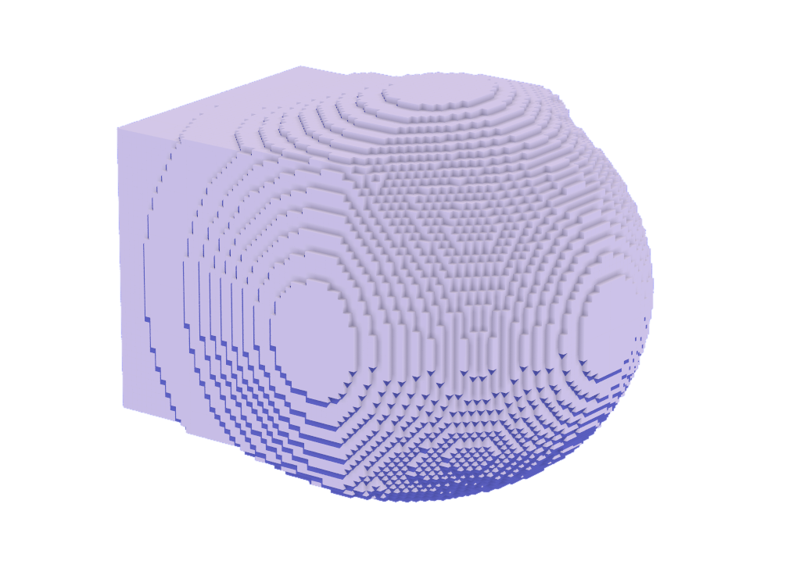

usage:

`daxa_f32 sd_smooth_union(in daxa_f32 a, in daxa_f32 b, in daxa_f32 k);`
```glsl
BoundingBox box;
box.bound_min = daxa_f32vec3(1);
box.bound_max = daxa_f32vec3(1 + 3 * 2);
value = sd_box(brush.p, box);

daxa_f32 r = 4;
daxa_f32vec3 center = daxa_f32vec3(3 + 1) + daxa_f32vec3(3, 0, 0);
value = sd_smooth_union(value, sd_sphere(brush.p - center, r), 2.0);
```

### Smooth Intersection


usage:

`daxa_f32 sd_smooth_intersection(in daxa_f32 a, in daxa_f32 b, in daxa_f32 k);`
```glsl
BoundingBox box;
box.bound_min = daxa_f32vec3(1);
box.bound_max = daxa_f32vec3(1 + 3 * 2);
value = sd_box(brush.p, box);

daxa_f32 r = 4;
daxa_f32vec3 center = daxa_f32vec3(3 + 1) + daxa_f32vec3(3, 0, 0);
value = sd_smooth_intersection(value, sd_sphere(brush.p - center, r), 2.0);
```

### Smooth Difference


usage:

`daxa_f32 sd_smooth_difference(in daxa_f32 a, in daxa_f32 b, in daxa_f32 k);`
```glsl
BoundingBox box;
box.bound_min = daxa_f32vec3(1);
box.bound_max = daxa_f32vec3(1 + 3 * 2);
value = sd_box(brush.p, box);

daxa_f32 r = 4;
daxa_f32vec3 center = daxa_f32vec3(3 + 1) + daxa_f32vec3(3, 0, 0);
value = sd_smooth_difference(value, sd_sphere(brush.p - center, r), 2.0);
```

## Shape Operators

---

### Plane


usage:

`daxa_f32 sd_plane(in daxa_f32vec3 p);`
```glsl
daxa_f32vec3 center = daxa_f32vec3(0, 0, 1);
value = sd_plane(brush.p - center);
```

### Sphere
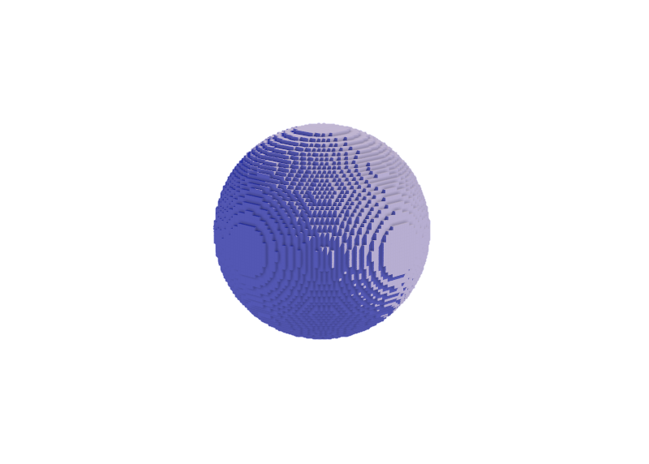

usage:

`daxa_f32 sd_sphere(in daxa_f32vec3 p, in daxa_f32 r);`
```glsl
daxa_f32 r = 4;
daxa_f32vec3 center = daxa_f32vec3(r + 1);
value = sd_sphere(brush.p - center, r);
```

### Ellipsoid
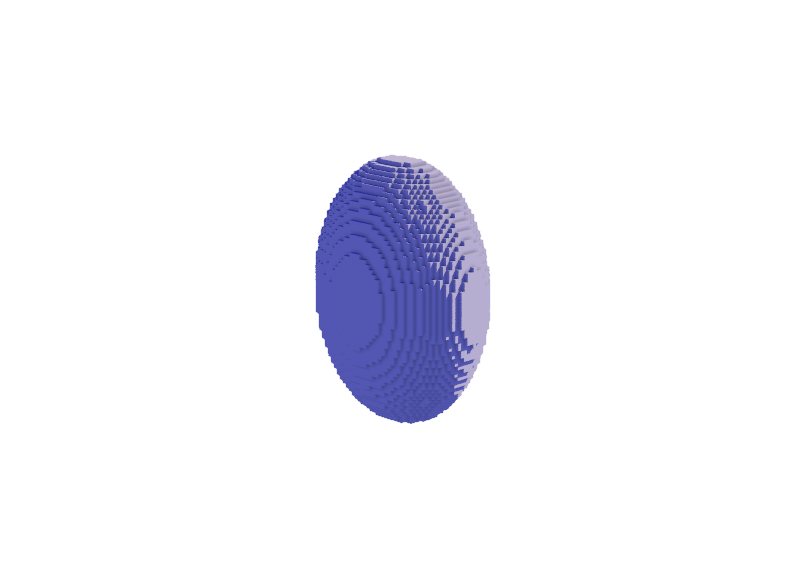

usage:

`daxa_f32 sd_ellipsoid(in daxa_f32vec3 p, in daxa_f32vec3 r);`
```glsl
daxa_f32vec3 r = daxa_f32vec3(2, 3, 4);
daxa_f32vec3 center = daxa_f32vec3(r + 1);
value = sd_ellipsoid(brush.p - center, r);
```

### Box
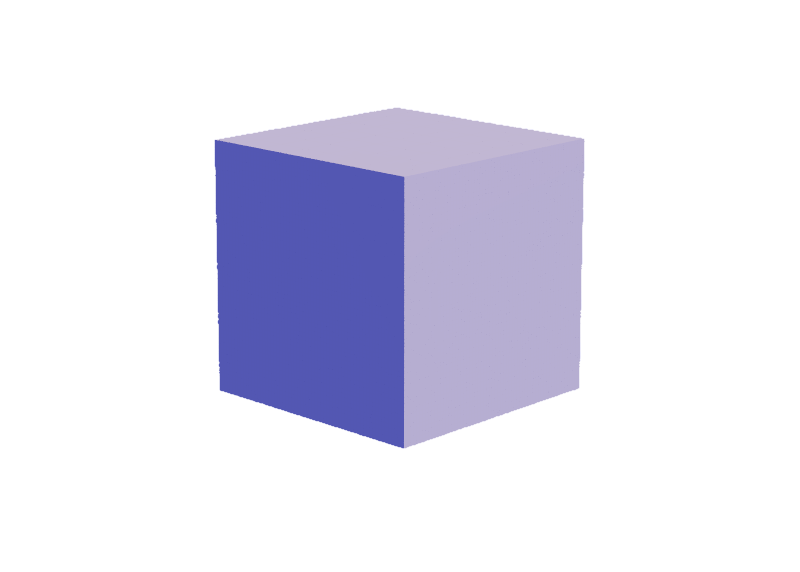

usage:

`daxa_f32 sd_box(in daxa_f32vec3 p, in daxa_f32vec3 size);`
```glsl
daxa_f32vec3 r = daxa_f32vec3(4);
daxa_f32vec3 center = r + 1;
value = sd_box(brush.p - center, r);
```

`daxa_f32 sd_box(in daxa_f32vec3 p, in BoundingBox box);`
```glsl
BoundingBox box;
box.bound_min = daxa_f32vec3(1);
box.bound_max = daxa_f32vec3(1 + 4 * 2);
value = sd_box(brush.p, box);
```

### Box Frame
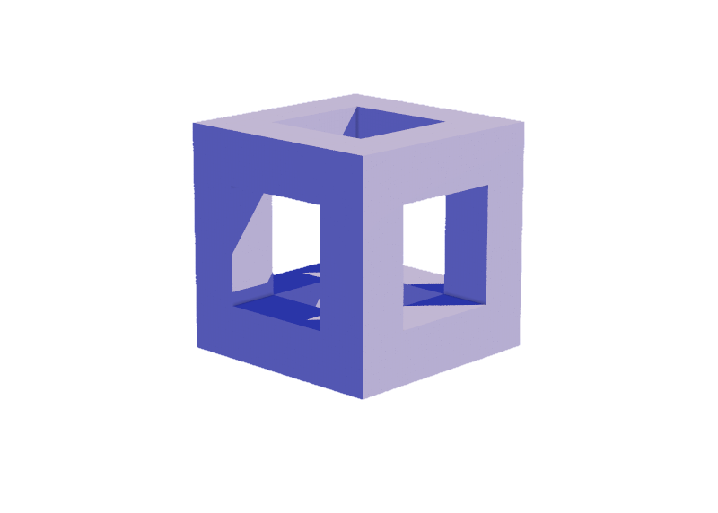

usage:

`daxa_f32 sd_box_frame(in daxa_f32vec3 p, in daxa_f32vec3 b, in daxa_f32 e);`
```glsl
daxa_f32vec3 r = daxa_f32vec3(4);
daxa_f32vec3 center = r + 1;
value = sd_box_frame(brush.p - center, r, 1);
```

or

`daxa_f32 sd_box_frame(in daxa_f32vec3 p, in BoundingBox box, in daxa_f32 e);`
```glsl
BoundingBox box;
box.bound_min = daxa_f32vec3(1);
box.bound_max = daxa_f32vec3(1 + 4 * 2);
value = sd_box_frame(brush.p, box, 1);
```

### Cylinder


usage:

`daxa_f32 sd_cylinder(in daxa_f32vec3 p, in daxa_f32 r, in daxa_f32 h);`
```glsl
daxa_f32 r = 4;
daxa_f32 h = 3;
daxa_f32vec3 center = daxa_f32vec3(r + 1, r + 1, h + 1);
value = sd_cylinder(brush.p - center, r, h);
```

or, in an arbitrary orientation:

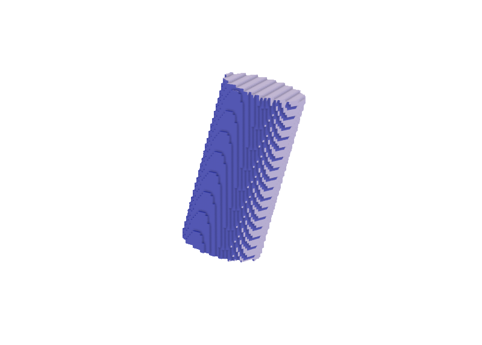

`daxa_f32 sd_cylinder(daxa_f32vec3 p, daxa_f32vec3 a, daxa_f32vec3 b, daxa_f32 r)`
```glsl
daxa_f32 r = 2;
daxa_f32vec3 p0 = daxa_f32vec3(r + 1) + daxa_f32vec3(0, 2, 0);
daxa_f32vec3 p1 = p0 + daxa_f32vec3(1, -2, 8);
value = sd_cylinder(brush.p, p0, p1, r);
```

### Triangular Prism


usage:

`daxa_f32 sd_triangular_prism(in daxa_f32vec3 p, in daxa_f32 r, in daxa_f32 h);`
```glsl
daxa_f32 r = 4;
daxa_f32 h = 3;
daxa_f32vec3 center = daxa_f32vec3(r + 1, r + 1, h + 1);
value = sd_triangular_prism(brush.p - center, r, h);
```

### Hexagonal Prism
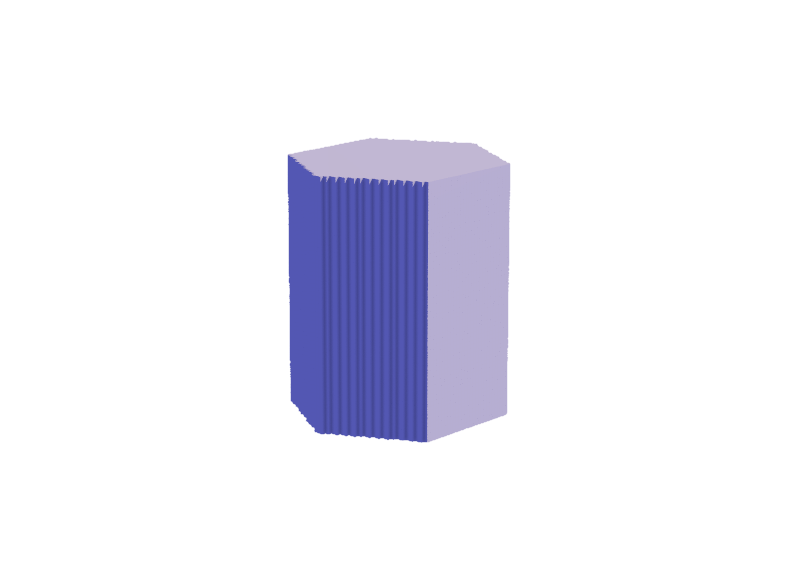

usage:

`daxa_f32 sd_hexagonal_prism(in daxa_f32vec3 p, in daxa_f32 r, in daxa_f32 h);`
```glsl
daxa_f32 r = 4;
daxa_f32 h = 3;
daxa_f32vec3 center = daxa_f32vec3(r + 1, r + 1, h + 1);
value = sd_hexagonal_prism(brush.p - center, r, h);
```

### Octagonal Prism


usage:

`daxa_f32 sd_octagonal_prism(in daxa_f32vec3 p, in daxa_f32 r, in daxa_f32 h);`
```glsl
daxa_f32 r = 4;
daxa_f32 h = 3;
daxa_f32vec3 center = daxa_f32vec3(r + 1, r + 1, h + 1);
value = sd_octagonal_prism(brush.p - center, r, h);
```

### Capsule
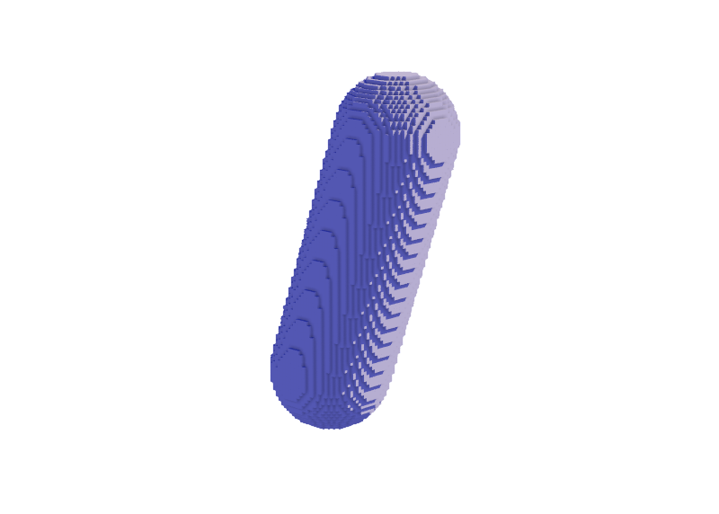

usage:

`daxa_f32 sd_capsule(in daxa_f32vec3 p, in daxa_f32vec3 a, in daxa_f32vec3 b, in daxa_f32 r);`
```glsl
daxa_f32 r = 2;
daxa_f32vec3 p0 = daxa_f32vec3(r + 1) + daxa_f32vec3(0, 2, 0);
daxa_f32vec3 p1 = p0 + daxa_f32vec3(1, -2, 8);
value = sd_capsule(brush.p, p0, p1, r);
```

### Cone


usage:

`daxa_f32 sd_cone(in daxa_f32vec3 p, in daxa_f32 c, in daxa_f32 h);`
```glsl
daxa_f32 slope = 5.0 / 8.0;
daxa_f32 h = 8;
daxa_f32vec3 center = daxa_f32vec3(h + 1);
value = sd_cone(brush.p - center, slope, h);
```

### Round Cone


usage:

`daxa_f32 sd_round_cone(in daxa_f32vec3 p, in daxa_f32 r1, in daxa_f32 r2, in daxa_f32 h);`
```glsl
daxa_f32 r0 = 3;
daxa_f32 r1 = 1;
daxa_f32 h = 8;
daxa_f32vec3 p = daxa_f32vec3(r0 + 1);
value = sd_round_cone(brush.p - p, r0, r1, h);
```

or, in an arbitrary orientation:

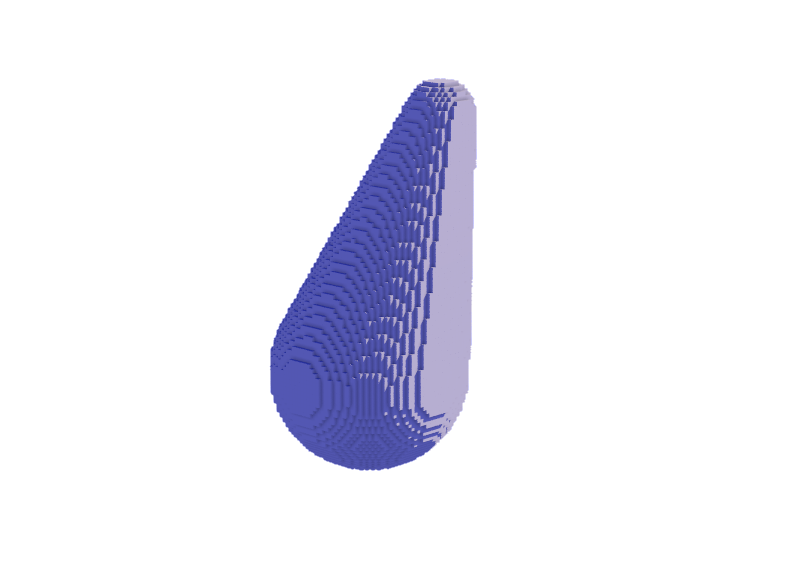

`daxa_f32 sd_round_cone(in daxa_f32vec3 p, in daxa_f32vec3 a, in daxa_f32vec3 b, in daxa_f32 r1, in daxa_f32 r2);`
```glsl
daxa_f32 r0 = 3;
daxa_f32 r1 = 1;
daxa_f32vec3 p0 = daxa_f32vec3(r0 + 1) + daxa_f32vec3(0, 2, 0);
daxa_f32vec3 p1 = p0 + daxa_f32vec3(1, -2, 8);
value = sd_round_cone(brush.p, p0, p1, r0, r1);
```

### Capped Cone


usage:

`daxa_f32 sd_capped_cone(in daxa_f32vec3 p, in daxa_f32 r1, in daxa_f32 r2, in daxa_f32 h);`
```glsl
daxa_f32 r0 = 3;
daxa_f32 r1 = 1;
daxa_f32 h = 4;
daxa_f32vec3 center = daxa_f32vec3(0, 0, h) + r0 + 1;
value = sd_capped_cone(brush.p - center, r0, r1, h);
```

or, in an arbitrary orientation:

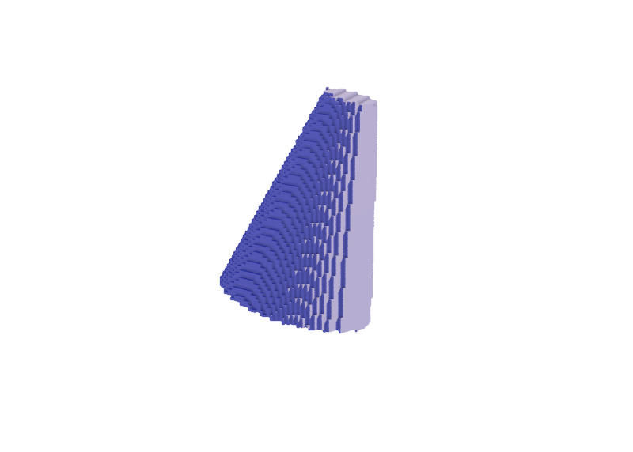

`daxa_f32 sd_capped_cone(in daxa_f32vec3 p, in daxa_f32vec3 a, in daxa_f32vec3 b, in daxa_f32 ra, in daxa_f32 rb);`
```glsl
daxa_f32 r0 = 3;
daxa_f32 r1 = 1;
daxa_f32vec3 p0 = daxa_f32vec3(r0 + 1) + daxa_f32vec3(0, 2, 0);
daxa_f32vec3 p1 = p0 + daxa_f32vec3(1, -2, 8);
value = sd_capped_cone(brush.p, p0, p1, r0, r1);
```

### Torus
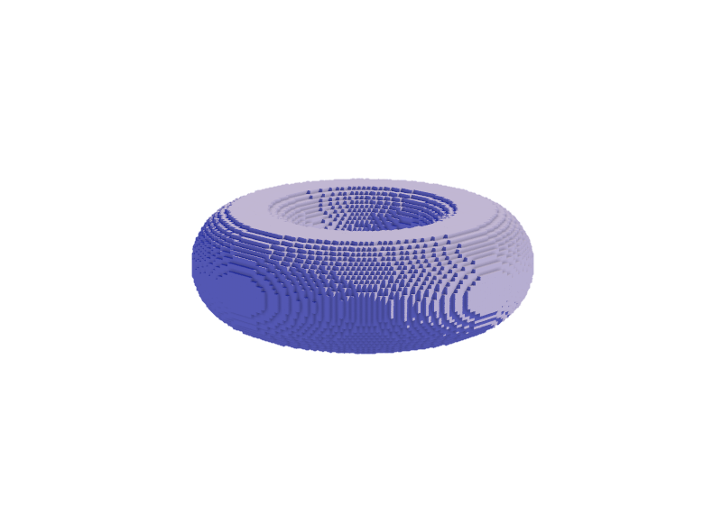

usage:

`daxa_f32 sd_torus(in daxa_f32vec3 p, in daxa_f32vec2 t);`
```glsl
daxa_f32vec2 r = daxa_f32vec2(4, 2);
value = sd_torus(brush.p - (daxa_f32vec3(r.x + r.y, r.x + r.y, r.y) + 1), r);
```

### Octahedron
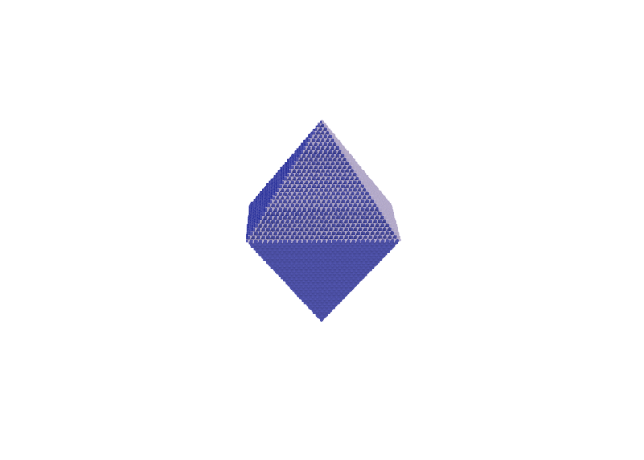

usage:

`daxa_f32 sd_octahedron(in daxa_f32vec3 p, in daxa_f32 s);`
```glsl
daxa_f32 r = 4;
daxa_f32vec3 center = daxa_f32vec3(r + 1);
value = sd_octahedron(brush.p - center, r);
```

### Pyramid
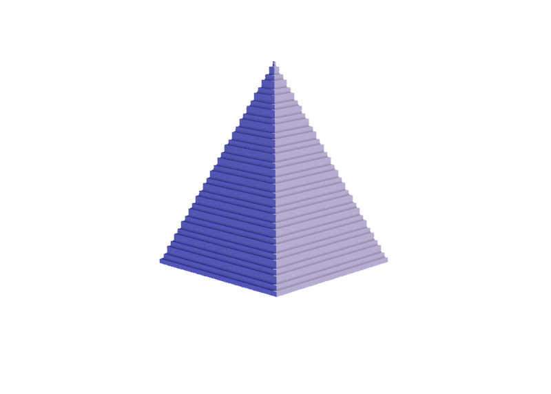

usage:

`daxa_f32 sd_pyramid(in daxa_f32vec3 p, in daxa_f32 r, in daxa_f32 h);`
```glsl
daxa_f32 r = 8;
daxa_f32 h = 10;
daxa_f32vec3 center = daxa_f32vec3(r + 1, r + 1, 1);
value = sd_pyramid(brush.p - center, r, h);
```
